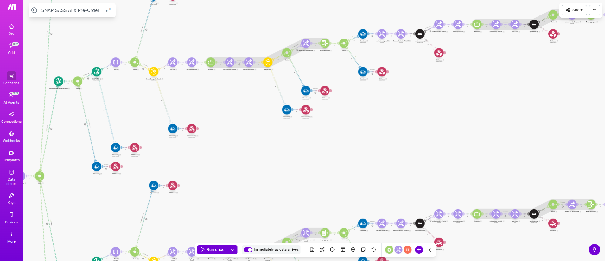
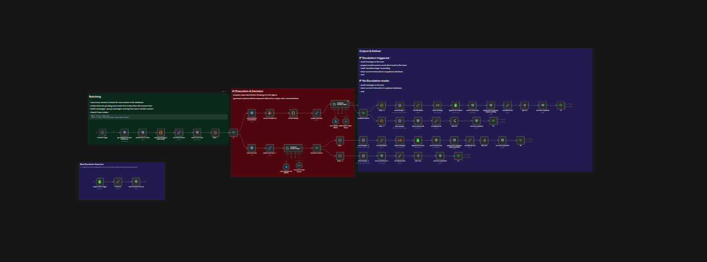
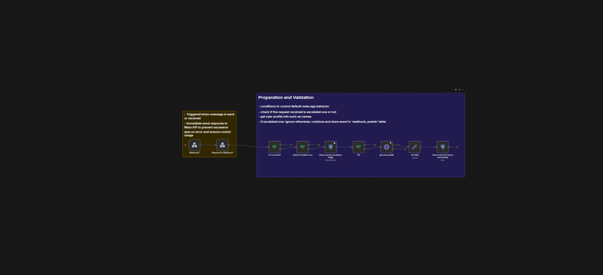
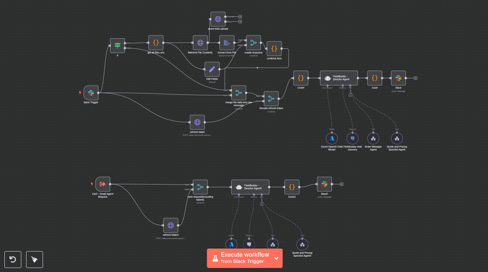
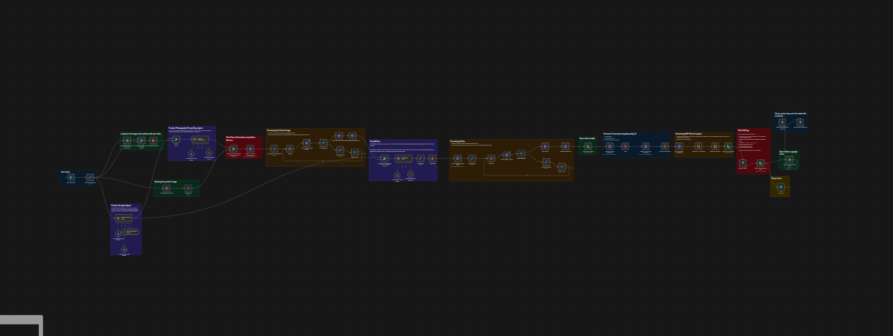

## THIS REPO SHOWSCASE FEW AUTOMATIONS I'VE BUILD IN PRODUCTION ENVIRONMENT

# 1. SASS Engine (Backend powering snapsass.com):

## Tools & Integration: Shopify, Printful, Bannerbear, OpenAI, Make.com

An AI-powered automation system that generates personalized roast merchandise—including T-shirts, mugs, hoodies, and tote bags. The workflow integrates OpenAI, Printful, Bannerbear, and Shopify to automatically receive order data from Shopify, generate a custom AI roast, overlay the text onto product mockups, and sync the final designs back to Shopify for fulfillment.

### INPUT:
 - Image to be roasted
 - Item size and color

### CORE LOGIC:

### OUTPUT:

# ======================================================================
# 2. Advance Instagram Agent 

## Tools & Integration : OpenAI, Meta API (Instagram), Meta App Setup, Supabase, Gmail, Google Sheet, JS/Python, n8n

An AI-powered automation system that efficiently manages high volumes of Facebook and Instagram messages without triggering actions for every single message.

Messages sent within a defined time window are batched together, so the system processes them as a group rather than responding to each message individually. This reduces unnecessary triggers, avoids spammy replies, and creates more natural, context-aware responses.

The chatbot includes an intelligent escalation system. Once a conversation is escalated:

1. Automated replies are paused

2. The team is notified via email

3. The conversation is handed over for human handling

Escalation status is managed through Google Sheets, allowing teams to easily control and track escalated conversations without technical complexity.

Overall, the system delivers controlled automation, smarter responses, and seamless human intervention—making it well-suited for businesses that need scale without sacrificing reliability or oversight.

# ======================================================================
# 3. Multi Agent Ecosystem

## Tools & Integration : Zoho CRM API, Slack, Azure OpenAI, N8N, PostgreSQL, Gmail, JS/Python

An autonomous multi-agent AI ecosystem that streamlines order processing through intelligent task orchestration. The system employs a master-slave pattern where a **central master agent** coordinates multiple specialized sub-agents, each responsible for specific workflow tasks including order processing, status updates, and customer communication. Integrated seamlessly with Zoho CRM for real-time data management and Slack as an interactive communication channel for gathering customer details and sending notifications.

# ======================================================================

# 4. Viral Content Generation Engine Powered by VEO 3.1

An n8n automation that creates studio-quality, interview-style videos in under 60 seconds. The workflow automatically pulls products from the catalog, generates realistic interview scenes featuring those products, adds synced captions, and delivers social-ready, polished video content - instantly transforming raw data into engaging marketing assets at scale.

<video src="images/sample_veo3_output.mp4" controls width="600" height="400"></video>

# ======================================================================

# Personal Projects

## 1. TermixAI (AI powered terminal)

### Tools & Integration : Azure OpenAI, Langchain, Textual Library, Linux, Python
TermixAI is a terminal application that bridges the gap between natural language and Linux commands. Simply describe what you want to accomplish in plain English, and TermixAI will generate, explain, and execute the appropriate commands through an elegant, chat-style interface.

Combining the power of AI with an intuitive chat interface. Instead of memorizing complex command syntax, just tell TermixAI what you need – it understands context, suggests optimal solutions, and helps you learn along the way.

<video src="https://github.com/user-attachments/assets/c1ba80ea-9236-4fc0-b7fd-f50f36e0f32c" controls width="600"></video>

Learn More about it here : https://github.com/rahul-08-11/termixai

## 2. NAIVE RAG BASED Agent Using Azure OpenAI and FastAPI

### Tools & Integration : Azure OpenAI, Langchain, FastAPI, Pinecone, Python, Function Calling

A traditional Rag Agent using Azure OpenAI and FastAPI. This is a basic implementation of a Rag Agent using Azure OpenAI and FastAPI.

Learn More about it here : https://github.com/rahul-08-11/first500days-ai

Thank you for reading. I hope you enjoyed it.